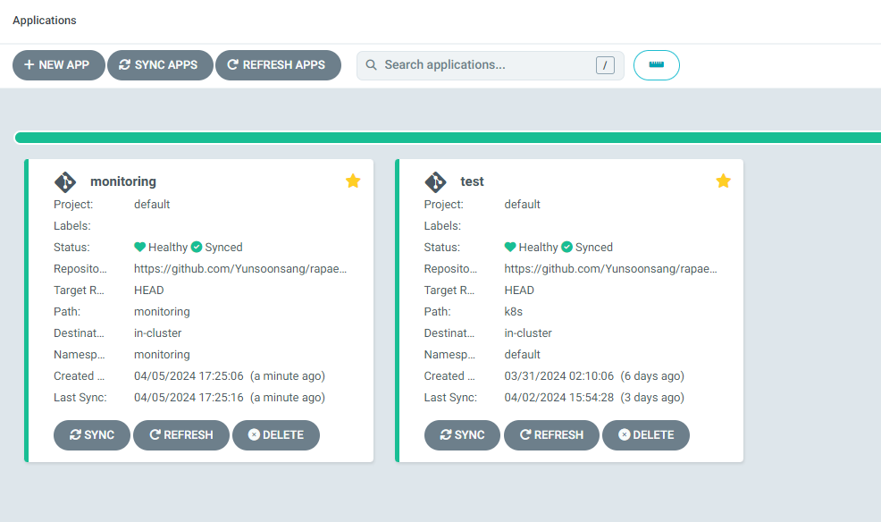
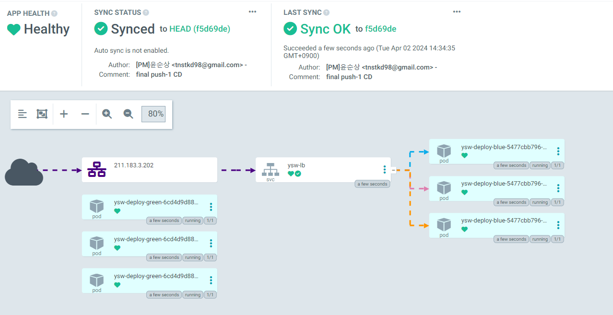
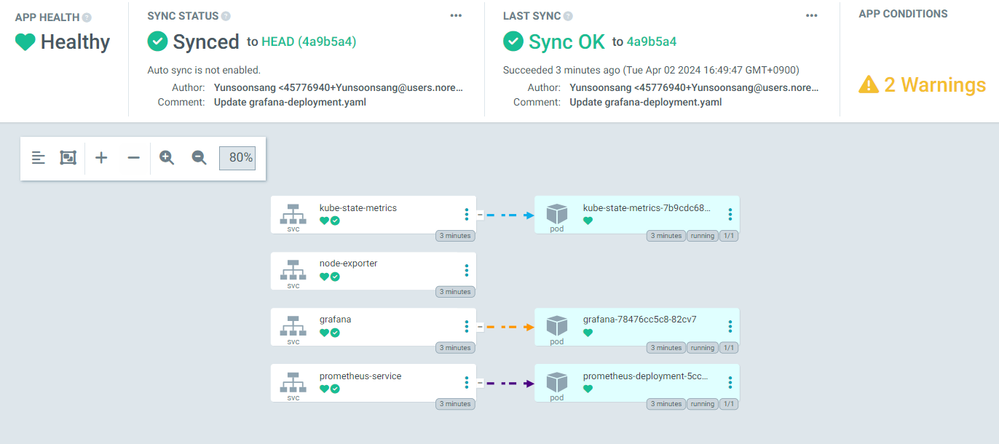

## **Continuous Deployment (CD) for Argocd**
### **설치방법**
- **kubernetes version : 1.28**
```bash
#argocd를 위한 namespace 생성
kubectl create ns argocd

#argocd yaml
kubectl apply -n argocd -f https://raw.githubusercontent.com/argoproj/argo-cd/stable/manifests/install.yaml

#모든 pod가 Running 상태인지 확인
k get pod -n argocd

#LB로 접속
kubectl patch svc argocd-server -n argocd -p '{"spec": {"type": "LoadBalancer"}}'

#초기 비밀번호 확인 (초기 아이디는 admin)
k describe secret argocd-initial-admin-secret -n argocd
kubectl -n argocd get secret argocd-initial-admin-secret -o jsonpath="{.data.password}" | base64 -d
```
### APP 생성
- **Path : /k8s /monitoring**
[](../etc/Argocd.png)
### 배포 완료
- **k8s app**
[](../etc/k8s-deploy.png)
- **monitoring app**
[](../etc/monitoring-deploy.png)
### **Check [here](https://github.com/Yunsoonsang/rapaeng4-CD.git) for the GitHub information used in the pipeline.**