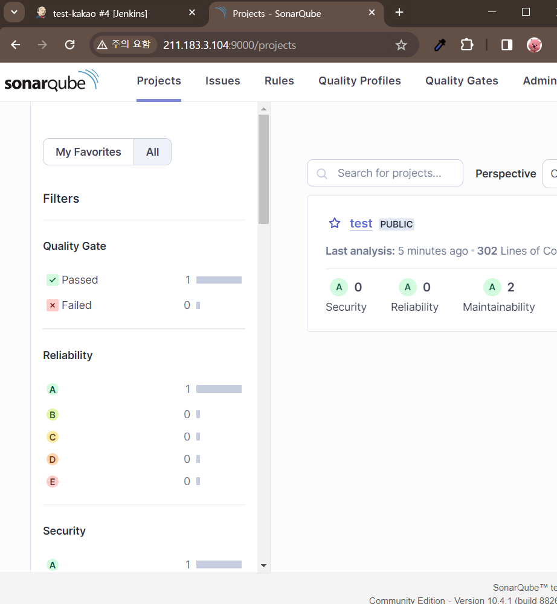

## **JDK 17 설치하기**

```bash
sudo apt install openjdk-17-jdk
java -version
# 환경변수 추가하기
PATH=$PATH:/usr/lib/jvm/java-17-openjdk-amd64/bin/
```
## **도커 컴포즈 배포 전에 사전 작업**

**1. `/etc/sysctl.conf` 파일 열기**

    ```bash
    vi /etc/sysctl.conf
    ```

**2. 맨 아래줄에 다음 내용 추가**

    ```
    vm.max_map_count=262144
    ```

**3. 변경사항 적용하기**

    ```bash
    sudo sysctl -p
    ```

**4. 볼륨 미리 생성하기**

    ```bash
    docker volume create sonarqube_data
    docker volume create sonarqube_extensions
    docker volume create sonarqube_logs
    docker volume create postgresql
    docker volume create postgresql_data
    ```
## **도커 컴포즈 배포 및 주의사항**

**1. 컴포즈 실행하기 => docker-compose -d up**

    ```YAML
    version: "3.7"

    services:
    sonarqube:
        image: sonarqube:community
        hostname: sonarqube
        container_name: sonarqube
        depends_on:
        - db
        restart: always
        environment:
        SONAR_JDBC_URL: jdbc:postgresql://db:5432/sonar
        SONAR_JDBC_USERNAME: sonar
        SONAR_JDBC_PASSWORD: sonar
        volumes:
        - sonarqube_data:/opt/sonarqube/data
        - sonarqube_extensions:/opt/sonarqube/extensions
        - sonarqube_logs:/opt/sonarqube/logs
        ports:
        - "9000:9000"

    db:
        image: postgres:12.18-alpine3.19
        hostname: postgresql
        container_name: postgresql
        restart: always
        environment:
        POSTGRES_USER: sonar
        POSTGRES_PASSWORD: sonar
        POSTGRES_DB: sonar
        volumes:
        - postgresql:/var/lib/postgresql
        - postgresql_data:/var/lib/postgresql/data

    volumes:
    sonarqube_data:
        external: true
    sonarqube_extensions:
        external: true
    sonarqube_logs:
        external: true
    postgresql:
        external: true
    postgresql_data:
        external: true    
    ```


**2. 절대 소나큐브에 한글 플러그인 같은 추가 설정 설치 하지 말기! - 소나큐브 망가짐**

**3. 소나 큐브의 초기 계정 정보 ⇒ admin / admin**

## **코드 분석 결과**
[](../etc/code-analysis.png)